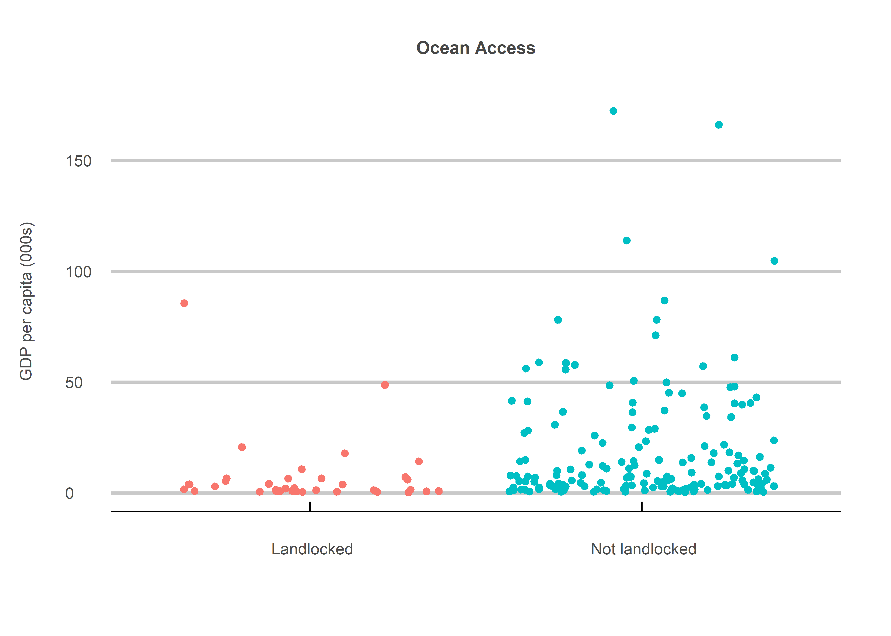
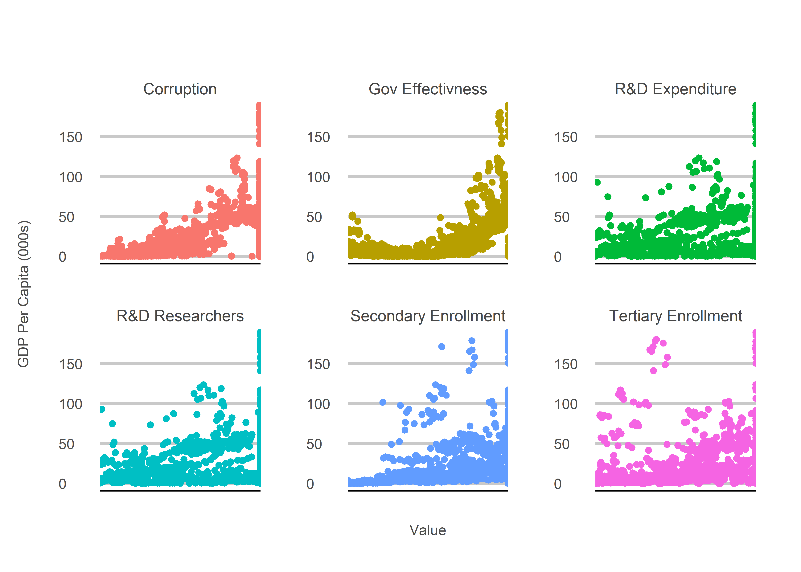
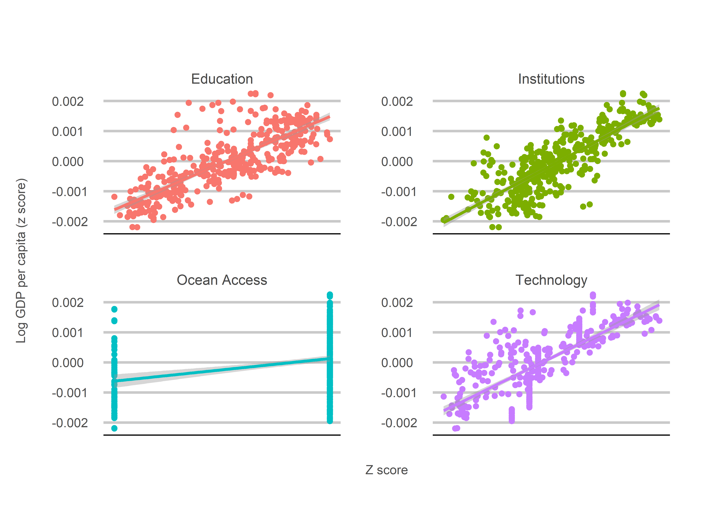
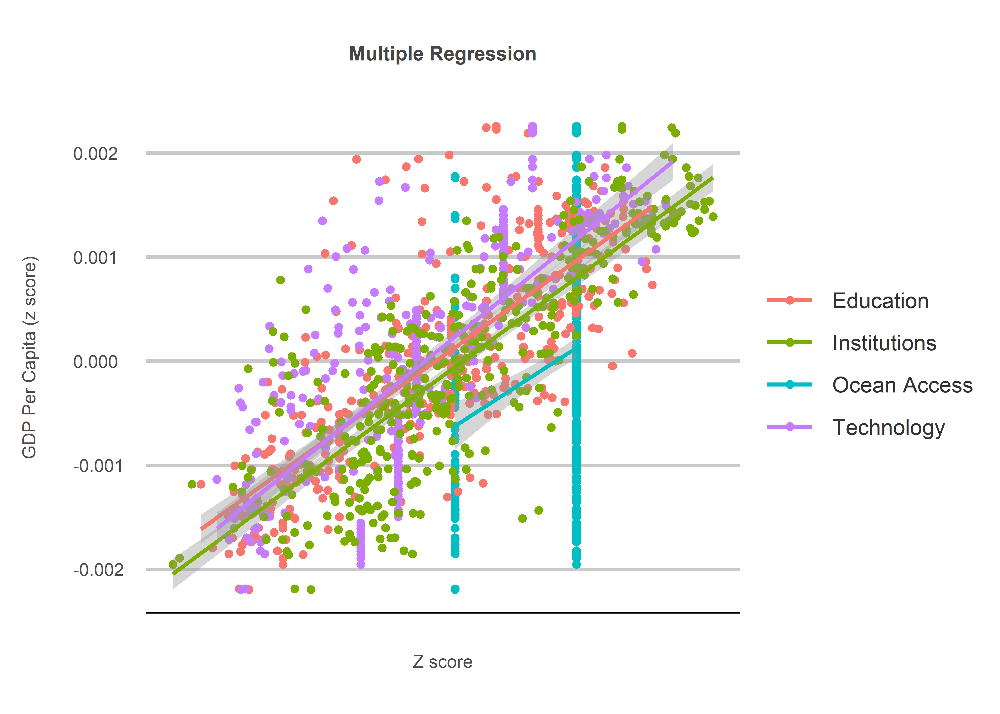

Cast Away
================
Jack Carter
5/5/2022

## **Summary**

Landlocked countries suffer from overland transport being more costly
and slower than maritime trade. Just like Tom Hanks in Cast Away, this
leaves their economies more isolated and less able to thrive. This is
supported with multiple regression analysis using combined data from the
World Bank, Transparency International and the Worldwide Governance
Indicators.

 

## Results

### **1) Raw Data**

The raw data suggest countries with ocean access have
on average $11,100 higher GDP per capita than those who do not. But does this
relationship hold up when the control data are added?

<!-- -->

    ##                              Estimate Std. Error  t value   Pr(>|t|)
    ## (Intercept)                  7.580009   4.241084 1.787281 0.07539136
    ## ocean_access Not landlocked 11.148109   4.673447 2.385415 0.01798415

 

### **2) Control Data:**

The control data are taken from the World Bank (secondary enrollment,
tertiary enrollment, R\&D expenditure and R\&D researchers),
Transparency International (the Corruption Perceptions Index) and the
Worldwide Governance Indicators (government effectiveness).

<!-- -->

 

### **3) Transformed Measures:**

The data are transformed and combined into new index measures for
education (secondary enrollment and tertiary enrollment), technology
(R\&D expenditure and R\&D researchers) and institutions (corruption and
government effectiveness).

<!-- -->

 

### **4) Final Results:**

The results show a statistically significant relationship for each
measure, with ocean access increasing GDP per capita by an average of
23.6 percent (with a p-value of 0.0000788).

<!-- -->

    ## 
    ## Call:
    ## lm(formula = y ~ ocean_access + education + technology + institutions)
    ## 
    ## Residuals:
    ##      Min       1Q   Median       3Q      Max 
    ## -0.94270 -0.30110 -0.06726  0.20822  1.49463 
    ## 
    ## Coefficients:
    ##              Estimate Std. Error t value Pr(>|t|)    
    ## (Intercept)  -0.10191    0.05489  -1.856   0.0641 .  
    ## ocean_access  0.23660    0.05931   3.989 7.88e-05 ***
    ## education     0.35752    0.03418  10.459  < 2e-16 ***
    ## technology    0.25985    0.04148   6.264 9.70e-10 ***
    ## institutions  0.45521    0.03429  13.276  < 2e-16 ***
    ## ---
    ## Signif. codes:  0 '***' 0.001 '**' 0.01 '*' 0.05 '.' 0.1 ' ' 1
    ## 
    ## Residual standard error: 0.4443 on 401 degrees of freedom
    ## Multiple R-squared:  0.8063, Adjusted R-squared:  0.8043 
    ## F-statistic: 417.2 on 4 and 401 DF,  p-value: < 2.2e-16

 

## **Disclaimer**

This is not proof that being landlocked negatively affects economic
development. It remains entirely possible that another factor not
accounted for here is causing the apparent difference we see between
landlocked and not landlocked countries. Yet while this remains
possible, the economics literature suggests education, technology and
institutions are the most reliable causal factors behind long term
economic growth. We can therefore be relatively confident in the results
obtained here, even if they cannot be taken as undeniable proof.

 

## **Method**

### **1) Reconcile Data Sets:**

Data from the World Bank, Transparency International and Worldwide
Governance Indicators are reconciled by identifying and changing common
yet non-identical country names.

—EXAMPLE CODE SNIPET—

``` r
# checks if any the data's country names appear as parts 
# of those in the TI list.  
get_data_non_idenitcal <- function(data, object) {
  scores <- list()
  for(i in 1:length(object)) {
    scores[[i]] <- if(mean(str_detect(object[i], data))>0) TRUE else FALSE
  }
  return(object[unlist(scores)])
}
```

 

### **2) Add Padded NA values:**

Padded NA values are added for the years that aren’t available in the
Transparency International data during the 2010s (as some of the
countries were not included prior to 2012).

—EXAMPLE CODE SNIPET—

``` r
# creates new data for each country in the 
# non identical list given.
create_country_data <- function(year, countries) {
  country_data <- list()
  for(i in 1:length(unique(countries))) {
    country_data[[i]] <- tibble(country = countries[i],
                                year = year,
                                col = NA)
  }
  return(rbind_pages(country_data))
}
```

 

### **3) Remove High NA Entries:**

Countries with a high number of NAs across multiple measures for each
year in the 2010s are identified and removed.

—EXAMPLE CODE SNIPET—

``` r
# checks for countries where most of the values are NA.  
check_na_values <- list()
for(i in 1:length(merged_data_frame$country)) {
  check_na_values[[i]] <- sum(is.na(merged_data_frame[i,4:ncol(merged_data_frame)]))>=ncol(merged_data_frame)-4
}
view(merged_data_frame[unlist(check_na_values),])
```

 

### **4) List Landlocked Countries:**

A list of landlocked countries is created by checking the countries in
the combined data set on Google Maps.

—EXAMPLE CODE SNIPET—

``` r
# lists the landlocked countries in our sample. 
landlocked <- c("Afghanistan",
                "Armenia",
                "Austria",
                "...",
                "Zambia",
                "Zimbabwe")

# creates an ocean access variable for non-landlocked countries. 
ocean_access <- list() 
for(i in 1:length(unique(merged_data_frame$country))) {
  ocean_access[[i]] <- if(!unique(merged_data_frame$country)[i] %in% landlocked) 1 else 0
}
ocean_access <- tibble(country = unique(merged_data_frame$country),
                       ocean_access = unlist(ocean_access))
```

 

### **5) Convert GDP Per Capita:**

GDP per capita is converted to its log values to reduce the large
variances between the richest countries and the rest.

—EXAMPLE CODE SNIPET—

``` r
# transforms gdp per capita into its log values. 
merged_data_frame$log_gdp_per_capita <- log(merged_data_frame$gdp_per_capita)
```

 

### **6) Check Distributions**

The distributions for each measure are checked with a histogram and
qqplot to see if they follow the normal distribution.

``` r
# creates a histogram. 
make_histogram <- function(variable) {
  histogram <- merged_data_frame %>%
    gather(key=measure, value = value, -c(1,2)) %>%
    filter(measure %in% variable) %>%
    mutate(value = as.numeric(value)) %>%
    ggplot(aes(x=value, fill=measure)) +
    geom_histogram(alpha=0.6,
                   position="identity",
                   bins=20) +
    facet_wrap(~measure,
               scales="free",
               ncol=2) +
    ggtitle("Histogram") +
    my_theme
  return(histogram)
}

# creates a qqplot.  
make_qqplot <- function(variable) {
  qqplot <- merged_data_frame %>%
    gather(key = measure, value = value, -c(1,2)) %>%
    filter(measure %in% variable) %>%
    mutate(value = as.numeric(value)) %>%
    ggplot(aes(sample=value, col=measure)) +
    geom_qq(position="identity") +
    geom_qq_line(position="identity") +
    facet_wrap(~measure,
               scales="free",
               ncol=2) +
    ggtitle("QQplot") +
    my_theme
  return(qqplot)
}
```

 

### **7) Transform Variables**

The variables that do not align perfectly with the normal distribution
are transformed and re-checked with a histogram and qqplot.

``` r
# transforms the variables. 
merged_data_frame$secondary_enrollment <- merged_data_frame$secondary_enrollment**(1/0.355)
merged_data_frame$tertiary_enrollment <- merged_data_frame$tertiary_enrollment**(1/2)
```

 

### **8) Z Score Transformation**

The data are transformed to their z score values so differences can be
compared accross multiple distributions.

``` r
# gets the z scores for each data distribution given. 
get_z_scores <- function(data) {
  mean <- mean(data[!is.na(data)])
  sigma <- sd(data[!is.na(data)])
  z_scores <- list()
  for(i in 1:length(data)) {
    z_scores[i] <- if(is.na(data[i])) NA else (data[i] - mean) / sigma
  }
  return(unlist(z_scores))
}
```

 

### **9) Check Outliers**

Outliers are checked by determining whether any of the values lie three
or more standard deviations away from the mean.

``` r
# checks for outliers of over 3 standard deviations. 
check_outliers <- function(vars) {
  outliers <- list()
  for(i in 1:length(vars)) {
    outliers[[i]] <- sum(abs(!is.na(merged_data_frame[,vars][i]))>3)
    print(paste0(outliers[[i]], " --- ", vars[i], " outliers"))
  }
}
```

 

### **10) Create New Measures**

New measures are created by converting the relevant z score
distributions into a tidy table before calculating the average for each
country. Two averages are calculated for the years 2010-2014 and
2015-2019, doubling the available observations. Even if a single ten
year average is taken, a statistically significant relationship between
ocean access and GDP per capita is still present.

``` r
# creates a tidy data frame of the z scores for 2 variables. 
get_tidy_z_scores <- function(vars) {
  df <- merged_data_frame[,c(groupby, vars)] %>%
    group_by(country, decade_half) %>%
    summarise(var_1 = get_avg(eval(parse(text=vars[1]))),
              var_2 = get_avg(eval(parse(text=vars[2]))))
  colnames(df) <- c(groupby,vars)
  final_df <- df %>%
    gather(key = measure, value = value, -c(1,2))
  return(final_df)
}

# gets the average z score for 2 variables. 
get_avg_z_scores <- function(z_scores) {
  df <- eval(parse(text=z_scores)) %>%
    group_by(country, decade_half) %>%
    summarise(col=sum(value[!is.na(value)]/length(value[!is.na(value)])))
  colnames(df)[3] <- z_scores
  return(df)
}
```

 

### **11) Check and Fill NAs**

Any remaining NA values for the resulting measures (taking a five year
average significantly helps in eliminating missing data problems) are
checked and filled based on the average for other countries with a
similar level of GDP per capita.

``` r
# imputes missing values by taking the average for 
# countries with a similar gdp per capita. 
fill_NAs <- function(measure, vars) {
  impute_values <- final_df %>%
    mutate(gdp_per_capita = round(gdp_per_capita)) %>%
    group_by(gdp_per_capita) %>%
    summarise(avg = mean(eval(parse(text=measure))))
  NAs <- final_df[final_df[,measure]==0,]
  imputations <- list()
  for(i in 1:nrow(NAs)) {
    imputations[[i]] <- impute_values$avg[which(impute_values["gdp_per_capita"] == round(NAs$gdp_per_capita[i]))]
  }
  final_df[pull(final_df[measure])==0,][measure] <- unlist(imputations)
  return(final_df)
}
```

 

### **12) Fit the Regression Model**

A regression model is fitted to determine whether the relationship
between ocean access and GDP per capita holds up.

``` r
# creates the variables for the regression analysis. 
y <- clean_variables_table$gdp_per_capita
ocean_access <- clean_variables_table$ocean_access
education <- clean_variables_table$education
technology <- clean_variables_table$technology
institutions <- clean_variables_table$institutions

# fits the regression model. 
fit <- lm(y~ocean_access+education+technology+institutions)
```

 

## **Sources**

  - OECD (2022) <https://www.oecd.org/ocean/topics/ocean-economy/>

  - Transaprency International (2022) <https://www.transparency.org/en/>

  - WGI (2022) <http://info.worldbank.org/governance/wgi/>

  - World Bank (2008)
    <https://www.worldbank.org/en/news/feature/2008/06/16/landlocked-countries-higher-transport-costs-delays-less-trade>

  - World Bank (2022) <https://data.worldbank.org/>
